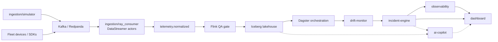

# ARGUS

**ARGUS** is a unified fleet telemetry, data-quality, MLOps, and observability platform: devices stream into a Kafka-compatible bus, Ray and Flink harden the data path, Iceberg + Dagster form the lakehouse spine, and drift / incident / OpenTelemetry layers close the loop for operators — with an AI copilot for query and explanation.

## Architecture



```text
ingestion/simulator ──► Kafka/Redpanda (telemetry.raw)
fleet devices/SDKs  ──┘         │
                                ▼
              Ray ingestion (DataStreamer actor pool)
                                │
                                ▼
                      telemetry.normalized
                                │
                                ▼
 Flink QA gate ──► Iceberg lakehouse ──► Dagster orchestration
                                                │
                                                ▼
                                         drift-monitor
                                                │
                                                ▼
                                         incident-engine
                                                │
                      ┌─────────────────────────┼─────────────────────────┐
                      ▼                         ▼                         ▼
                observability               dashboard                 ai-copilot
```

## Monorepo layout

| Path | Language | Purpose | Stage |
|------|----------|---------|-------|
| `shared/` | Multi | Contracts, schemas, shared libs | Phase 1 |
| `ingestion/` | Python (Ray) | Simulator + Ray consumer (raw → normalized) | Phase 2 |
| `stream-processor/` | Java/Python (Flink) | Streaming data-quality gate | Later |
| `drift-monitor/` | Python | Feature/prediction drift detection | Later |
| `lakehouse/` | SQL/Python | Iceberg tables and catalog layout | Later |
| `orchestration/` | Python (Dagster) | Asset jobs, sensors, ML lifecycle | Later |
| `incident-engine/` | Go | Alert correlation and incidents | Later |
| `api-gateway/` | Go | Authz (OPA), routing, public APIs | Later |
| `observability/` | YAML/+ | OTel, dashboards, SLO alerts | Later |
| `ai-copilot/` | Python | NL query/explain over platform data | Later |
| `dashboard/` | TypeScript | Operator UI | Later |
| `sdk/python/` | Python | Client SDK for emitters and APIs | Later |
| `sdk/typescript/` | TypeScript | Client SDK for web/Node | Later |
| `cli/` | Go | Operator CLI (`argus`) | Later |
| `infra/terraform/` | HCL | Cloud/EKS foundation | Later |
| `infra/helm/` | YAML | Kubernetes charts | Later |
| `infra/argocd/` | YAML | GitOps applications | Later |
| `examples/` | Multi | Sample producers and walkthroughs | Ongoing |
| `docs/` | Markdown | ADRs, runbooks, guides | Ongoing |
| `tests/e2e/` | Multi | Cross-service golden-path tests | Later |

## Quick start (local)

```bash
cp .env.example .env
make up          # Redpanda + Console + simulator + Ray consumer
make logs        # follow compose logs
make down        # tear down
```

See [ARCHITECTURE.md](./ARCHITECTURE.md) for system design and [CONTRIBUTING.md](./CONTRIBUTING.md) for the phase-based build process.

## License

Apache License 2.0 — see [LICENSE](./LICENSE).
