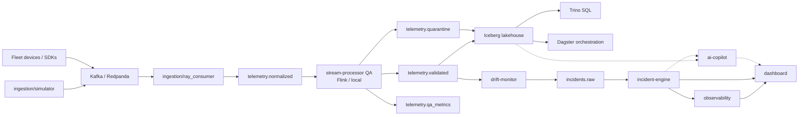

# ARGUS

[](https://github.com/hamidmatiny/Argus/actions/workflows/ci.yml)
[](https://github.com/hamidmatiny/Argus/actions/workflows/docker-build.yml)
[](https://github.com/hamidmatiny/Argus/actions/workflows/semgrep.yml)
[](https://github.com/hamidmatiny/Argus/actions/workflows/e2e-nightly.yml)
[](https://github.com/hamidmatiny/Argus/actions/workflows/load-nightly.yml)
[](https://github.com/hamidmatiny/Argus/actions/workflows/chaos-nightly.yml)

**ARGUS** is a unified fleet telemetry, data-quality, MLOps, and observability platform: devices stream into a Kafka-compatible bus, Ray and Flink harden the data path, Iceberg + Dagster form the lakehouse spine, and drift / incident / OpenTelemetry layers close the loop for operators — with an AI copilot for query and explanation.

**CI quality gate:** component unit tests enforce **≥ 65%** coverage (Python `--cov-fail-under=65`, Go total cover), matching the vanguard-style minimum. See [CONTRIBUTING.md](./CONTRIBUTING.md) for required checks and nightly e2e/load workflows.

## Architecture



```text
ingestion/simulator ──► telemetry.raw
fleet devices/SDKs  ──┘       │
                              ▼
              Ray ingestion (DataStreamer actors)
                              │
                              ▼
                    telemetry.normalized
                              │
                              ▼
              stream-processor QA (Flink | local)
                     │            │            │
                     ▼            ▼            ▼
           telemetry.validated  quarantine  qa_metrics
                     │  \         \
                     │   \         └──► lakehouse-dlq-writer → fleet.quarantine
                     │    └──► drift-monitor ──► incidents.raw ──► incident-engine
                     ▼
         lakehouse-writer → fleet.telemetry → Trino / Dagster
                                                              │
                                         observability / dashboard / ai-copilot
```

## Monorepo layout

| Path | Language | Purpose | Stage |
|------|----------|---------|-------|
| `shared/` | Multi | Contracts, schemas, shared libs | Phase 1 |
| `ingestion/` | Python (Ray) | Simulator + Ray consumer (raw → normalized) | Phase 2 |
| `stream-processor/` | Python (PyFlink + local) | QA gate → validated / quarantine / qa_metrics | Phase 3 |
| `drift-monitor/` | Python | KS + Evidently drift on validated → `incidents.raw` | Phase 4 |
| `lakehouse/` | Python + SQL | Iceberg `fleet.telemetry` / `fleet.quarantine` + Trino | Phase 5 |
| `orchestration/` | Python (Dagster) | Assets + MLflow retrain lineage (+ optional Feast) | Phase 6 |
| `incident-engine/` | Go | OPA policies + circuit breaker → `incidents.escalated` | Phase 7 |
| `api-gateway/` | Go | gRPC+REST edge, Keycloak OIDC, OPA RBAC | Phase 9 |
| `observability/` | YAML/+ | Prometheus, Grafana, Loki, Jaeger, Alertmanager | Phase 8 |
| `dashboard/` | TypeScript | Operator UI (Next.js) | Phase 10 |
| `sdk/python/` | Python | `argus-sdk` — gateway + ingest | Phase 11 |
| `sdk/typescript/` | TypeScript | `@argus/sdk` — gateway client | Phase 11 |
| `cli/` | Go | Operator CLI (`argusctl`), secrets + gateway ops | Phase 11 |
| `examples/` | Multi | Third-party integration samples | Phase 11 |
| `ai-copilot/` | Python | RAG + tool-calling ops assistant | Phase 13 |
| `infra/terraform/` | HCL | VPC, EKS, MSK, Iceberg/S3+Glue, IRSA | Phase 12 |
| `infra/helm/` | YAML | Per-service charts + NetworkPolicies/HPA | Phase 12 |
| `infra/argocd/` | YAML | App-of-apps GitOps | Phase 12 |
| `docs/` | Markdown | ADRs, runbooks, guides | Ongoing |
| `tests/e2e/` | Multi | Full-stack smoke, k6 load, chaos recovery | Phase 14 |

## Quick start (local)

```bash
cp .env.example .env
make up          # Redpanda + Console + simulator + Ray consumer
make logs        # follow compose logs
make down        # tear down
```

## CI & quality gates

| Workflow | Trigger | What it does |
|----------|---------|----------------|
| **CI** | Every PR / push | Path-filtered lint+test per component; **≥65%** coverage on gated packages |
| **Docker Build** | Dockerfile / service paths | Matrix build + `/health` smoke, Trivy HIGH/CRITICAL, Syft SBOM artifacts |
| **Semgrep** | Every PR / push | SAST (`p/ci`, `p/security-audit`, `p/owasp-top-ten`) — required check |
| **E2E Nightly** | Nightly + manual | Compose full stack, 60s simulator, assert telemetry + QA rejection via gateway |
| **Load Nightly** | Nightly + manual | k6 against api-gateway (p95 ping &lt; 500ms) |
| **Chaos Nightly** | Nightly + manual | Kill `stream-processor`, assert health recovery |

Branch protection should require **`CI success`** and **`Semgrep SAST`**. Details: [CONTRIBUTING.md](./CONTRIBUTING.md).

See [ARCHITECTURE.md](./ARCHITECTURE.md) for system design.

## License

Apache License 2.0 — see [LICENSE](./LICENSE).
