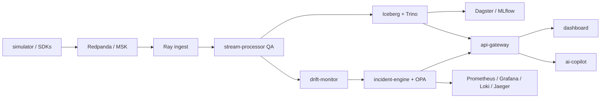

# ARGUS

[](https://github.com/hamidmatiny/Argus/actions/workflows/ci.yml)
[](https://github.com/hamidmatiny/Argus/actions/workflows/docker-build.yml)
[](https://github.com/hamidmatiny/Argus/actions/workflows/semgrep.yml)
[](https://github.com/hamidmatiny/Argus/actions/workflows/e2e-nightly.yml)
[](./docs/)

**ARGUS** is a production-shaped fleet telemetry platform: devices stream into a Kafka-compatible bus, Ray and Flink harden the data path, Iceberg + Dagster form the lakehouse spine, and drift / OPA incidents / OpenTelemetry close the loop for operators — with a read-only AI copilot for investigation. Clone it, `docker compose up`, and you get the same contracts and images that target EKS via Terraform, Helm, and Argo CD.

**Docs:** [Getting Started](./docs/getting-started.md) · [Demo Script (5 min)](./docs/DEMO_SCRIPT.md) · [Case Study](./docs/CASE_STUDY.md) · [ADRs](./docs/adr/) · [CHANGELOG v1.0.0](./CHANGELOG.md)

---

## Architecture



```text
simulator/SDKs → telemetry.raw → Ray → normalized → QA ─┬→ validated → Iceberg / drift
                                                       ├→ quarantine → Iceberg DLQ
                                                       └→ qa_metrics → incidents → gateway → UI
```

Full design: [ARCHITECTURE.md](./ARCHITECTURE.md) · [docs/architecture.md](./docs/architecture.md)

---

## Quick Start (< 5 minutes)

```bash
git clone https://github.com/hamidmatiny/Argus.git && cd Argus
cp .env.example .env
echo "NEXTAUTH_SECRET=$(openssl rand -base64 32)" >> .env
echo "NEXTAUTH_URL=http://localhost:3002" >> .env
echo "AUTH_DEMO_OFFLINE=true" >> .env
docker compose up -d --build
```

| Open | URL |
|------|-----|
| Dashboard | http://localhost:3002 — login `operator` / `operator` |
| Grafana | http://localhost:3001 — `admin` / `argus` |
| Gateway health | http://localhost:8099/health |
| Redpanda Console | http://localhost:8087 |

```bash
curl -s http://localhost:8099/v1/ping
curl -s -X POST http://localhost:8099/v1/telemetry/query \
  -H 'Content-Type: application/json' -H 'X-API-Key: demo-viewer' \
  -d '{"sql":"SELECT vehicle_id FROM telemetry LIMIT 5","limit":5}'
```

Tear down: `docker compose down -v`

---

## Screenshots

<!-- SCREENSHOT:dashboard-overview — drop PNG at docs/assets/screenshots/dashboard-overview.png -->
**Dashboard — Overview** *(placeholder)*  
`docs/assets/screenshots/dashboard-overview.png` — TODO: capture Overview with live throughput after login.

<!-- SCREENSHOT:dashboard-incidents — docs/assets/screenshots/dashboard-incidents.png -->
**Dashboard — Incidents** *(placeholder)*  
`docs/assets/screenshots/dashboard-incidents.png` — TODO: open incidents + breaker state.

<!-- SCREENSHOT:grafana — docs/assets/screenshots/grafana-slos.png -->
**Grafana — SLOs** *(placeholder)*  
`docs/assets/screenshots/grafana-slos.png` — TODO: QA pass ratio / gateway latency panels.

Also see `dashboard/docs/screenshots/*.png.txt` markers.

---

## Components

| Component | Role | README |
|-----------|------|--------|
| [`shared/`](./shared/) | Contracts (Avro / Proto / JSON Schema) | [README](./shared/README.md) |
| [`ingestion/`](./ingestion/) | Simulator + Ray normalize | [README](./ingestion/README.md) |
| [`stream-processor/`](./stream-processor/) | Streaming QA gate | [README](./stream-processor/README.md) |
| [`drift-monitor/`](./drift-monitor/) | KS + Evidently drift | [README](./drift-monitor/README.md) |
| [`lakehouse/`](./lakehouse/) | Iceberg writers + Trino | [README](./lakehouse/README.md) |
| [`orchestration/`](./orchestration/) | Dagster + MLflow | [README](./orchestration/README.md) |
| [`incident-engine/`](./incident-engine/) | OPA + circuit breakers | [README](./incident-engine/README.md) |
| [`api-gateway/`](./api-gateway/) | Authn/z edge API | [README](./api-gateway/README.md) |
| [`observability/`](./observability/) | Metrics, logs, traces, alerts | [README](./observability/README.md) |
| [`dashboard/`](./dashboard/) | Next.js operator UI | [README](./dashboard/README.md) |
| [`ai-copilot/`](./ai-copilot/) | Read-only RAG assistant | [README](./ai-copilot/README.md) |
| [`sdk/python/`](./sdk/python/) | `argus-sdk` | [README](./sdk/python/README.md) |
| [`sdk/typescript/`](./sdk/typescript/) | `@argus/sdk` | [README](./sdk/typescript/README.md) |
| [`cli/`](./cli/) | `argusctl` | [README](./cli/README.md) |
| [`infra/`](./infra/) | Terraform · Helm · Argo CD | [README](./infra/README.md) |
| [`tests/e2e/`](./tests/e2e/) | Smoke · load · chaos | [README](./tests/e2e/README.md) |
| [`docs/`](./docs/) | MkDocs site · ADRs · demo | [README](./docs/README.md) |

---

## Tech Stack

| Category | Technologies |
|----------|----------------|
| **Streaming** | Apache Kafka API, Redpanda, Amazon MSK, Ray, Apache Flink / PyFlink |
| **Storage** | Apache Iceberg, MinIO, Amazon S3, AWS Glue, Trino, Parquet |
| **Orchestration** | Dagster, Feast *(optional)*; AWS Lambda + Step Functions + EventBridge + SQS *(serverless ETL demo — not the production Kafka path; see [ADR 007](./docs/adr/007-serverless-etl-alongside-kafka.md))* |
| **ML** | MLflow, Evidently, SciPy KS tests, embeddings (hash / OpenAI) |
| **Observability** | OpenTelemetry, Prometheus, Grafana, Loki, Promtail, Jaeger, Alertmanager |
| **Security** | Keycloak (OIDC), OPA/Rego, API keys + RBAC, Trivy, Syft SBOM, Semgrep |
| **Frontend** | Next.js (App Router), TypeScript, Tailwind, NextAuth, Recharts |
| **Infra** | Docker Compose, Terraform, Helm, Argo CD, Amazon EKS, IRSA |
| **AI** | Qdrant, tool-calling LLM agents (OpenAI / Anthropic / mock), RAG runbooks |
| **Languages** | Python 3.12, Go 1.22, TypeScript / Node 22 |
| **Quality** | pytest, Go test, Vitest, Playwright, k6, GitHub Actions |

**CI coverage gate:** ≥ **65%** on gated packages (see [CONTRIBUTING.md](./CONTRIBUTING.md)).

---

## Documentation site

```bash
pip install -r docs/requirements.txt
mkdocs serve   # http://127.0.0.1:8000
```

---

## License

Apache License 2.0 — see [LICENSE](./LICENSE).
