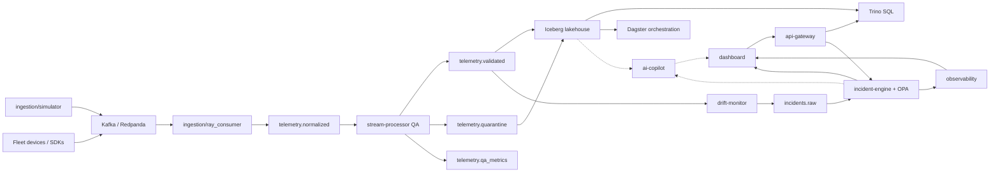
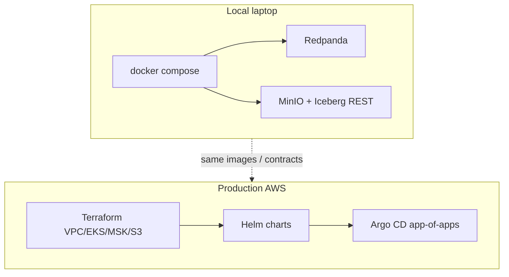

# Architecture

North-star design for ARGUS. Implementation lives in component directories; this page is the map.

## Goals

- **Unified plane** for fleet telemetry, data quality, MLOps, and ops observability
- **Contract-first** ingestion so bad data is quarantined early
- **Lakehouse spine** (Iceberg) that analytics and ML can trust
- **Closed loop** from drift → incidents → dashboards / copilot
- **Same contracts** locally (docker compose) and in production (EKS + GitOps)

## System diagram



## Data flow (ASCII)

```text
[devices/simulator] → telemetry.raw → [Ray] → telemetry.normalized
                                                    │
                                                    ▼
                                          [stream-processor QA]
                                           /        |         \
                                          v         v          v
                                   validated   quarantine   qa_metrics
                                    /    |  \         \
                                   /     |   \         └──► [dlq-writer] → fleet.quarantine
                                  v      |    v
                    [lakehouse-writer]   |  [drift-monitor] → incidents.raw
                            │            |                         │
                            v            |                         v
                     fleet.telemetry     |                  [incident-engine]
                            │            |
                         [Trino] ←——— Iceberg REST + MinIO/S3
                            │
                         [Dagster]
                                                          ↙         ↘
                                               [observability]   [dashboard]
                                                          ↖         ↗
                                                           [ai-copilot]
```

## Component responsibilities

| Component | Responsibility |
|-----------|----------------|
| Fleet devices / SDKs | Emit typed telemetry to Kafka |
| Kafka / Redpanda | Durable ordered bus |
| ingestion (Ray) | Normalize `telemetry.raw` → `telemetry.normalized` |
| stream-processor | Streaming QA → validated / quarantine / qa_metrics |
| lakehouse (Iceberg) | Append + Trino SQL |
| orchestration (Dagster) | Assets, Evidently → MLflow, retrain events |
| drift-monitor | KS + Evidently → `incidents.raw` |
| incident-engine | OPA + circuit breaker → escalated incidents |
| api-gateway | Authn/authz, north-south API |
| observability | Metrics, logs, traces, SLOs |
| dashboard | Human ops UI |
| ai-copilot | Read-only RAG + tools over governed APIs |
| cli | Operator tooling (`argusctl`) |

## Local vs production



**Parity rule:** same container images and config shape; only infrastructure and scale differ.

## Further reading

- Root [ARCHITECTURE.md](https://github.com/hamidmatiny/Argus/blob/main/ARCHITECTURE.md)
- [ADRs](adr/index.md) for technology trade-offs
- [Components](components/index.md) for per-service deep links
